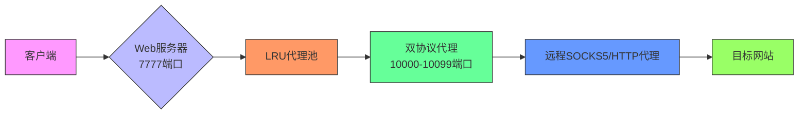
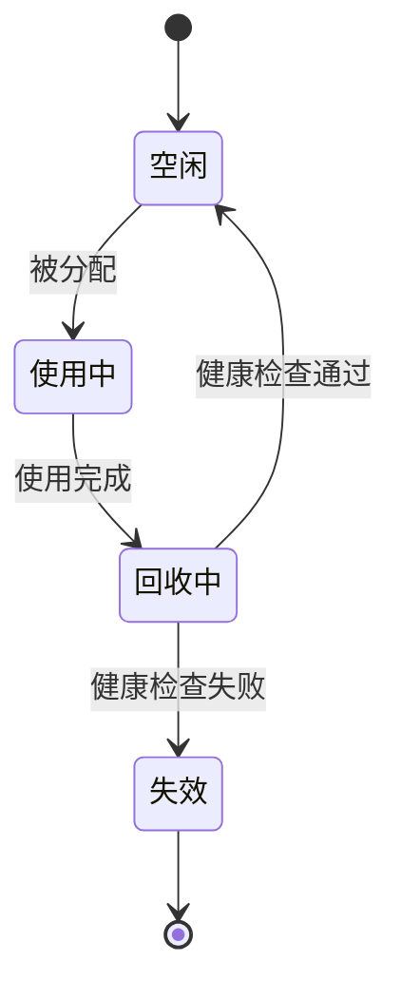
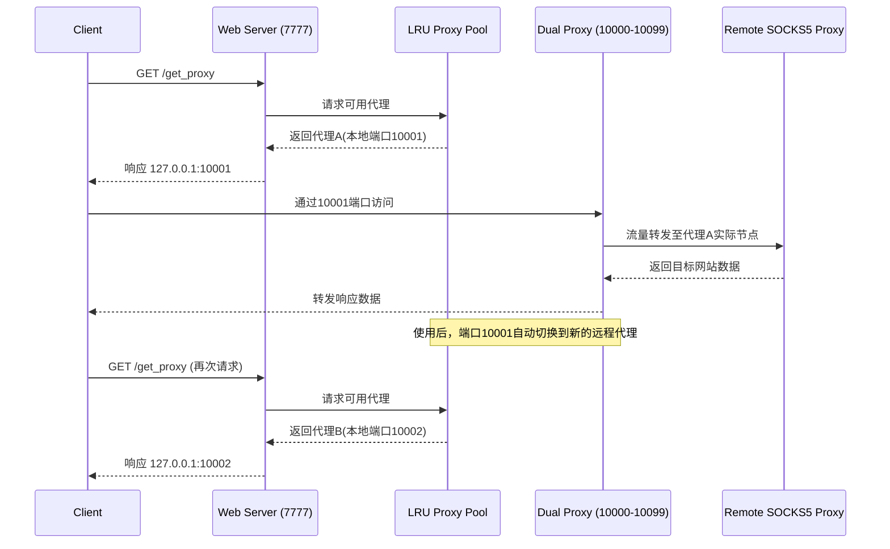

# 高性能多协议代理池系统 v1.0.1

一个高效的代理池系统，支持HTTP、HTTPS和SOCKS5协议，能够将带验证的远程代理转换为本地无验证代理，并提供自动轮换功能。系统采用LRU（最近最少使用）算法管理代理，针对高并发场景进行了优化。

## 主要功能

- **多协议支持**：同时支持HTTP、HTTPS和SOCKS5协议
- **代理转换**：将带验证的远程代理转换为本地无验证代理
- **端口轮换**：每次访问Web服务器刷新一次端口
- **一次性使用**：每个端口在使用后自动切换到新的代理
- **高并发支持**：优化的锁机制和代理池预热，支持高并发请求
- **大规模代理**：支持使用大量代理，自动跳过无效代理
- **统计信息**：提供代理使用情况的统计信息

## 系统架构



- **代理服务器**：双协议代理服务器，同时支持HTTP和SOCKS5
- **代理池**：LRU代理池，高效管理大量代理
- **Web服务器**：提供简单的HTTP接口获取代理地址
- **主程序**：proxy_server_main.py，系统入口



## 快速开始

### 安装与配置

```bash
# 1. 安装依赖
pip install -r requirements.txt

# 2. 配置代理 (all_proxies.txt)
# 格式: IP地址 端口 用户名 密码
# 例如: 192.168.1.1 1080 username password

# 3. 启动服务器
python proxy_server_main.py --max-active-proxies 100
```

### 使用方法

1. **获取代理**: 访问 `http://127.0.0.1:7777`
2. **使用代理**: 使用返回的地址 (如 `127.0.0.1:10001`)
3. **查看统计**: 访问 `http://127.0.0.1:7777/stats`

## 工作原理

系统通过以下流程工作：

1. **初始化**: 预热代理池，准备多个本地端口
2. **请求处理**: 客户端请求代理时返回一个本地端口
3. **代理转发**: 本地端口将流量转发到远程代理
4. **自动切换**: 使用后端口自动切换到新的远程代理

## 系统流程图



## 命令行参数

```bash
python proxy_server_main.py --help
```

主要参数：
- `--host`：Web服务器地址 (默认: 127.0.0.1)
- `--port`：Web服务器端口 (默认: 7777)
- `--proxy-file`：代理列表文件 (默认: all_proxies.txt)
- `--max-active-proxies`：最大活跃代理数量 (默认: 200)

## 应用场景

- **网络爬虫**：频繁切换IP地址的爬虫程序
- **数据采集**：避免IP被封禁的数据采集程序
- **API访问**：绕过API访问限制的应用
- **匿名访问**：匿名访问互联网的应用
- **高并发系统**：处理大量并发请求的系统

## 高级配置

```bash
# 增加活跃代理数量，提高并发能力
python proxy_server_main.py --max-active-proxies 300

# 性能测试
python test_proxy.py
```

## 许可证

MIT
